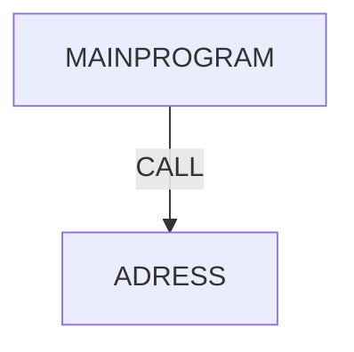

# COBOL Program Dependencies

## Dependency Flow Diagram

## Description

- **MAINPROGRAM**: Ana program, kullanıcı ID'sini alır ve ADRESS programını çağırır
- **ADRESS**: Verilen ID için adres bilgisini döndürür

---

Generated by CrewAI - COBOL to Java Converter
