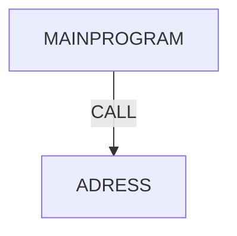

# COBOL Program Dependencies

## Dependency Flow Diagram



## Description

| Program | Description |
|---------|-------------|
| MAINPROGRAM | Ana program, kullanıcı ID'sini alır ve ADRESS programını çağırır |
| ADRESS | Verilen ID için adres bilgisini döndürür |

## Call Hierarchy

```
MAINPROGRAM
    └── CALL ADRESS
```

---

Generated by CrewAI - COBOL to Java Converter
